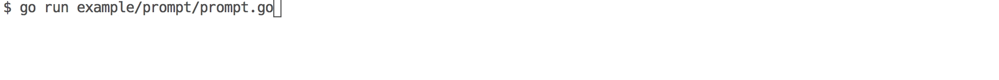

# uiutil [](https://godoc.org/github.com/gosuri/uiutil) [](https://travis-ci.org/gosuri/uiutil)
uiutil is a go library that provides a set of helpers to improve readbility in terminal applications.

## Features

* __Hidden Prompts__: Provides a prompter for capturing sensitive data (passwords).
* __Buffered Printer__: Printer object to buffer UI components that can be flushed.
* __Title Decorator__: Decorator for formating titles.

## Usage Example

### Hidden Prompts

```go
var pass string
uiutil.PromptHiddenString(&pass, "Password: ")
fmt.Println("Password is", pass)
```
Renders:


Full source for above example is available at [example/prompt/prompt.go](example/prompt/prompt.go)

## Installation

```
$ go get github.com/gosuri/uiutil/...
```
